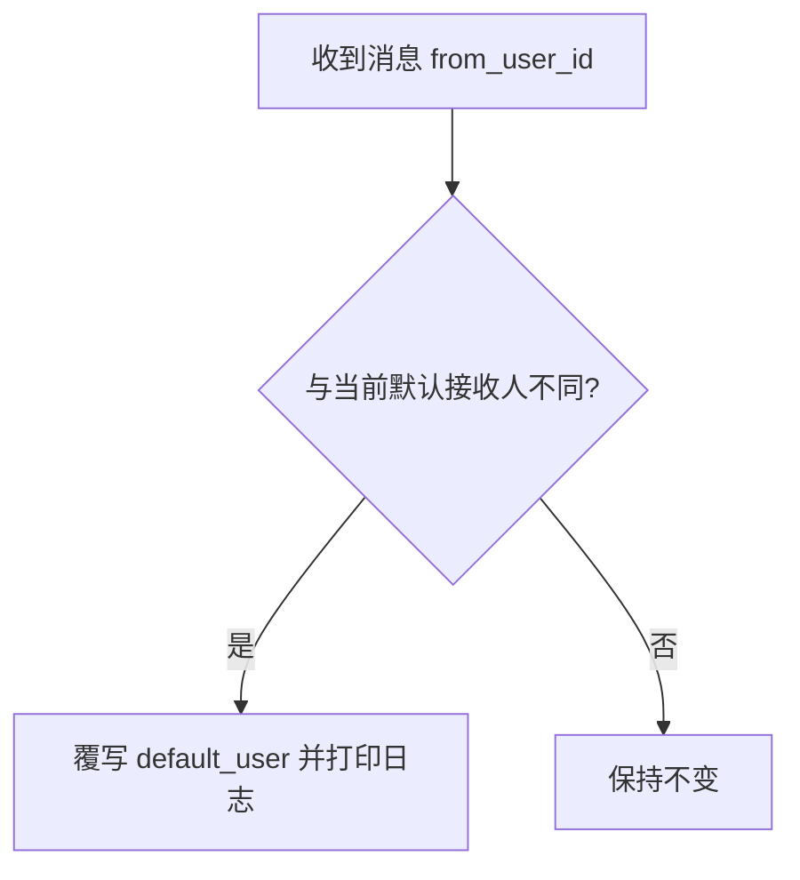
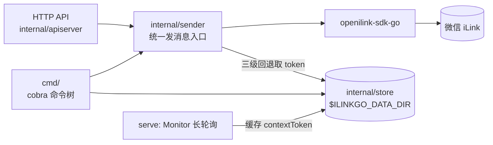
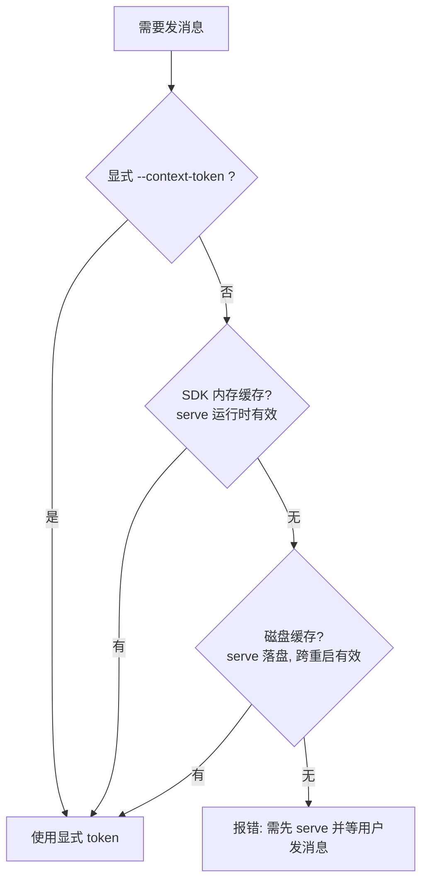

# ilinkgo

[](https://github.com/phpgao/ilinkgo/actions/workflows/docker.yml)
[](https://github.com/phpgao/ilinkgo/releases)
[](LICENSE)
[](https://pkg.go.dev/github.com/phpgao/ilinkgo)
[](go.mod)
[](https://github.com/phpgao/ilinkgo/pkgs/container/ilinkgo)
[](https://github.com/phpgao/ilinkgo/releases)

基于 [openilink-sdk-go](https://github.com/openilink/openilink-sdk-go) 的微信 iLink Bot 发消息工具：一个二进制，同时提供**命令行**和**本地 HTTP API** 两种入口，覆盖 iLink 支持的全部可发送消息类型。

命令行基于 [cobra](https://github.com/spf13/cobra)，自带 `help` 与 shell 补全。

## 安装

```bash
# 方式一：下载预编译二进制（linux/darwin/windows × amd64/arm64）
curl -LO https://github.com/phpgao/ilinkgo/releases/latest/download/ilinkgo_darwin_arm64
chmod +x ilinkgo_darwin_arm64 && ./ilinkgo_darwin_arm64 --version

# 方式二：go install
go install github.com/phpgao/ilinkgo@latest

# 方式三：源码构建
go build -o ilinkgo .
ilinkgo completion bash > /usr/local/etc/bash_completion.d/ilinkgo   # 可选

# 方式四：容器（见「容器运行」）
docker pull ghcr.io/phpgao/ilinkgo:latest
```

Release 产物命名：`ilinkgo_<os>_<arch>`（Windows 带 `.exe`），同时提供 `.sha256` 与汇总的 `SHA256SUMS`。打 `v*` tag 即自动发布。

## 快速开始

```bash
./ilinkgo login                        # 终端直接显示二维码，扫码登录
./ilinkgo serve                        # 常驻：长轮询 + HTTP API（127.0.0.1:9100）
./ilinkgo send text --text "你好"        # --to 可省略，见下方「默认接收人」
```

`login` 会把微信返回的绑定地址渲染成二维码（Unicode 半块字符，兼容 iTerm2/Terminal/VS Code）；终端字体或配色导致扫不出来时，二维码下方会同时打印原始 URL，可在浏览器打开。

容器里没有终端时，用 `serve` + `/api/login` 完成绑定（见 [HTTP API](#http-api)）。

> iLink 协议要求：bot 只能给**给它发过消息的用户**推送。所以首次使用需要先 `serve`，等目标用户给 bot 发一条消息，工具会自动缓存该用户的 `contextToken`。

## 命令

| 命令 | 说明 |
|------|------|
| `login` | 扫码登录，保存 bot token / base_url |
| `logout` | 清除已保存的会话 |
| `serve` | 运行消息监听 + HTTP API |
| `send <type>` | 发送消息，`type` 见下表 |

### send 类型

| type | 参数 | ilink item type |
|------|------|-----------------|
| `text` | `--to` `--text` | 1 `text_item` |
| `image` | `--to` `--file` `[--caption]` | 2 `image_item` |
| `video` | `--to` `--file` `[--caption]` | 5 `video_item` |
| `file` | `--to` `--file` `[--caption]` | 4 `file_item` |
| `media` | `--to` `--file` `[--caption]` | 按扩展名自动判别 |
| `typing` | `--to` `--ticket` `[--off]` | 输入状态指示器 |

`send` 公共参数：`--to`（**可选**）、`--context-token`（可选，跳过缓存）。全局参数 `--data-dir` 见下方配置。

> voice（item type 3）SDK 仅支持**接收**，协议侧没有发送接口，因此不在上表中。

```bash
./ilinkgo send image --file photo.png --caption "看图"     # 发给默认接收人
./ilinkgo send media --to wxid_xxx --file report.pdf      # 指定接收人，自动走 file_item
```

### 默认接收人

`--to` 省略时，发给**最近一个给 bot 发过消息的用户**：`serve` 的后台长轮询每收到新消息就把 `from_user_id` 记为默认接收人（有新人发言就替换）。这样脚本和 API 都不用关心用户 ID。



需要固定发给某人时显式传 `--to`（或 API 的 `to`）即可覆盖。还没人发过消息时，发送会报 `no recipient: ...`。

## HTTP API

`serve` 启动时监听 `127.0.0.1:9100`（`--listen` 改），需要 Bearer 鉴权。token 首次启动自动生成并存盘，也可用 `--token` 或环境变量 `ILINKGO_API_TOKEN` 指定。

**未登录时 `serve` 不会退出**，它会一直等待绑定，方便容器里先起服务再扫码。

```bash
curl -X POST http://127.0.0.1:9100/api/send/text \
  -H "Authorization: Bearer <token>" \
  -d '{"text":"你好"}'
```

| 端点 | body | 说明 |
|------|------|------|
| `GET /healthz` | — | 健康检查 |
| `POST /api/login` | — | 扫码绑定，返回绑定 URL；重复调用可查进度 |
| `POST /api/send/text` | `to?`, `text`, `context_token?` | |
| `POST /api/send/image` | `to?`, `file_path`, `caption?`, `context_token?` | |
| `POST /api/send/video` | 同上 | |
| `POST /api/send/file` | 同上 | |
| `POST /api/send/media` | 同上（自动判别类型） | |
| `POST /api/send/typing` | `to?`, `ticket`, `on` | |

`to` 全部可选，省略时用默认接收人。

### 容器里绑定（`/api/login`）

```bash
curl -X POST http://127.0.0.1:9100/api/login -H "Authorization: Bearer <token>"
```

```json
{
  "ok": true,
  "status": "wait",
  "url": "https://liteapp.weixin.qq.com/q/7GiQu1?qrcode=...&bot_type=3",
  "qr_ascii": "████ ▄▄▄▄▄ ██ ...",
  "message": ""
}
```

- `status`：`wait`（待扫码）→ `scanned`（已扫码待确认）→ `confirmed`（已绑定）；失败为 `error` 并带 `message`
- `url`：微信绑定地址，浏览器打开或手机扫码；`qr_ascii` 是同一地址的终端二维码，`curl ... | jq -r .qr_ascii` 可直接在 shell 里扫
- 绑定成功后凭证落盘，并通过回调唤醒 monitor，**无需重启 serve**；再次调用返回 `confirmed`

未绑定时调用发送接口，返回 `409` + `not logged in: POST /api/login ...`，不会抛出上游的晦涩错误。

`file_path` 是**本机路径**（服务进程可读即可）。

响应：`{"ok":true,"client_id":"..."}`，失败 `{"ok":false,"error":"..."}` 并返回 4xx/502。
`/api/send/media` 走 SDK 的高级接口，拿不到单条 `client_id`，只返回 `{"ok":true}`。

## 架构



```
main.go                  cobra Execute 入口
cmd/root.go              root 命令 + --data-dir + newSender
cmd/login.go             login / logout
cmd/serve.go             serve（monitor + API）
cmd/send.go              send 及其子命令
internal/{sender,store,apiserver}
```

CLI 直连 SDK，不经过 HTTP API，因此临时发一条消息无需常驻 `serve`。

### contextToken 三级回退



## 配置

路径与密钥都可以通过环境变量或 flag 指定，不需要写死 `~/.ilinkgo`：

| 环境变量 | 对应 flag | 说明 |
|---------|----------|------|
| `ILINKGO_DATA_DIR` | `--data-dir` | 状态目录，flag 优先级更高，默认 `~/.ilinkgo` |
| `ILINKGO_API_TOKEN` | `serve --token` | HTTP API bearer token，flag 优先级更高；两者都为空时自动生成并存盘 |

```bash
export ILINKGO_DATA_DIR=/data/ilinkgo
ilinkgo send text --to wxid_xxx --text "hi"        # 走 /data/ilinkgo
ilinkgo send text --data-dir /tmp/x --to wxid_xxx --text "hi"   # flag 覆盖
```

## 落盘状态（默认 `~/.ilinkgo`，权限 0600）

| 文件 | 内容 |
|------|------|
| `credentials.json` | bot token / base_url / bot_id |
| `context_tokens.json` | 用户 ID → contextToken |
| `default_user` | 默认接收人（最近发消息的用户） |
| `sync_buf.dat` | 长轮询游标，重启后续传 |
| `api_token.txt` | HTTP API bearer token |

## 容器运行

镜像由 GitHub Actions 自动构建，支持 `linux/amd64` 与 `linux/arm64`：

```bash
docker run -d --name ilinkgo \
  -p 9100:9100 \
  -v ilinkgo-data:/data \
  -e ILINKGO_API_TOKEN=your-token \
  ghcr.io/phpgao/ilinkgo:latest
```

| 镜像 tag | 含义 |
|---------|------|
| `latest` / `main` | main 分支最新构建 |
| `v0.1.0` 等 | 对应 git tag 的发布版本 |

### docker compose

```yaml
services:
  ilinkgo:
    image: ghcr.io/phpgao/ilinkgo:latest
    container_name: ilinkgo
    restart: unless-stopped
    ports:
      - "9100:9100"
    environment:
      ILINKGO_API_TOKEN: your-token   # 可省略，省略时自动生成并存到 /data/api_token.txt
      TZ: Asia/Shanghai
    volumes:
      - ilinkgo-data:/data            # 凭证与 contextToken，务必持久化

volumes:
  ilinkgo-data:
```

```bash
docker compose up -d
docker compose logs -f ilinkgo
docker exec ilinkgo cat /data/api_token.txt   # 省略 token 时查看自动生成的那个
```

要点：

- 状态目录固定在 `/data`（**挂卷**保存凭证，否则重启要重新扫码）
- 容器内监听 `0.0.0.0:9100`（覆盖了默认的 127.0.0.1）
- 首次启动未绑定，用 `/api/login` 拿绑定地址扫码即可，不需要重启

## 许可证

[MIT](LICENSE)

```bash
go build ./...
go vet ./...
golangci-lint run ./...
```
